# mcp-probe-pilot Class Diagram — Functional Modules & Top-Level Data

Simplified view: functional modules and the top-level data models they use or produce. Lower-level data types (e.g. `ServerInfo`, `CodeEntity`, `ScenarioPlan`, `GherkinStep`, `ExchangeViolation`, etc.) are omitted.

```mermaid
classDiagram
    direction TB

    %% ──────────────────────────────────────
    %% Functional modules
    %% ──────────────────────────────────────

    class CLI {
        <<module: cli.py>>
        +main(repo_root, generate_new, debug)
    }

    class MCPProbeOrchestrator {
        <<orchestrator>>
        +run_discovery() DiscoveryResult
        +run_ast_indexing() CodebaseIndex
        +run_unit_test_planning() UnitTestPlanResult
        +run_integration_test_planning() IntegrationTestPlanResult
        +generate_feature_files() GenerationResult
        +validate_and_format_feature_files() GherkinFeatureCollection
        +generate_step_implementations() StepImplementationResult
        +run_tests() TestExecutionResult
        +run_compliance_validation() ComplianceReport
        +generate_and_push_report() ProbeReport
    }

    class MCPDiscoverer {
        <<discovery>>
        +discover_all() DiscoveryResult
    }

    class ASTIndexer {
        <<discovery>>
        +index_directory(path) CodebaseIndex
    }

    class Planner {
        <<planning>>
        +plan_tool_unit_tests() list
        +plan_resource_unit_tests() list
        +plan_prompt_unit_tests() list
        +plan_integration_tests() IntegrationTestPlanResult
    }

    class GherkinFeatureGenerator {
        <<generation>>
        +generate_all() GenerationResult
    }

    class GherkinFormatter {
        <<generation>>
        +parse_feature_files() GherkinFeatureCollection
        +format_directory() GherkinFeatureCollection
    }

    class StepImplementationGenerator {
        <<generation>>
        +generate_all() StepImplementationResult
    }

    class FeatureValidator {
        <<validation>>
        +validate_collection() ValidationResult
    }

    class TestExecutor {
        <<execution>>
        +run_tests() TestExecutionResult
    }

    class ComplianceValidator {
        <<compliance>>
        +validate_file() ComplianceReport
        +validate_traffic() ComplianceReport
    }

    class ReportBuilder {
        <<reporting>>
        +build_report() ProbeReport
        +build_and_push_report() ProbeReport
    }

    %% ──────────────────────────────────────
    %% Top-level data models only
    %% ──────────────────────────────────────

    class ProbeConfig {
        <<BaseModel>>
        +project_code : str
        +server_command : str
        +transport : str
        +service_url : str
        +generate_new : bool
        +server_id : str
    }

    class DiscoveryResult {
        <<BaseModel>>
        +server_info
        +tools
        +resources
        +prompts
        +tool_count : int
        +resource_count : int
        +prompt_count : int
    }

    class CodebaseIndex {
        <<BaseModel>>
        +entities
        +file_hashes
        +total_files : int
        +total_entities : int
    }

    class UnitTestPlanResult {
        <<BaseModel>>
        +tool_scenarios
        +resource_scenarios
        +prompt_scenarios
        +num_scenarios : int
    }

    class IntegrationTestPlanResult {
        <<BaseModel>>
        +integration_scenarios
        +num_scenarios : int
    }

    class GherkinFeatureCollection {
        <<BaseModel>>
        +features
        +get_all_steps()
        +get_unique_step_texts()
    }

    class GenerationResult {
        <<BaseModel>>
        +files_generated : int
        +files_failed : int
        +validation_warnings
    }

    class StepImplementationResult {
        <<BaseModel>>
        +steps_generated : int
        +steps_skipped : int
        +output_file : Path
        +validation_errors
        +discovered_dependencies
    }

    class TestExecutionResult {
        <<BaseModel>>
        +success : bool
        +total_scenarios : int
        +passed : int
        +failed : int
        +duration : float
    }

    class ValidationResult {
        <<dataclass>>
        +total_features : int
        +total_steps : int
        +compliant : int
        +normalised : int
        +rejected : int
        +is_valid : bool
    }

    class ComplianceReport {
        <<BaseModel>>
        +spec_version : str
        +scenarios
        +passed : bool
        +total_violations : int
        +total_errors : int
        +total_warnings : int
    }

    class ProbeReport {
        <<BaseModel>>
        +project_code : str
        +timestamp : datetime
        +summary_test_passed : bool
        +mcp_compliant : bool
        +total_features : int
        +total_scenarios : int
        +passed_scenarios : int
        +failed_scenarios : int
    }

    %% ──────────────────────────────────────
    %% Relationships: who uses/produces what
    %% ──────────────────────────────────────

    CLI --> MCPProbeOrchestrator : creates

    MCPProbeOrchestrator --> ProbeConfig : holds
    MCPProbeOrchestrator --> MCPDiscoverer : uses
    MCPProbeOrchestrator --> ASTIndexer : uses
    MCPProbeOrchestrator --> Planner : uses
    MCPProbeOrchestrator --> GherkinFeatureGenerator : uses
    MCPProbeOrchestrator --> GherkinFormatter : uses
    MCPProbeOrchestrator --> StepImplementationGenerator : uses
    MCPProbeOrchestrator --> FeatureValidator : uses
    MCPProbeOrchestrator --> TestExecutor : uses
    MCPProbeOrchestrator --> ComplianceValidator : uses
    MCPProbeOrchestrator --> ReportBuilder : uses

    MCPDiscoverer ..> DiscoveryResult : produces
    ASTIndexer ..> CodebaseIndex : produces
    Planner ..> UnitTestPlanResult : produces
    Planner ..> IntegrationTestPlanResult : produces
    GherkinFeatureGenerator ..> GenerationResult : produces
    GherkinFeatureGenerator ..> UnitTestPlanResult : uses
    GherkinFeatureGenerator ..> IntegrationTestPlanResult : uses
    GherkinFeatureGenerator ..> DiscoveryResult : uses
    GherkinFormatter ..> GherkinFeatureCollection : produces
    GherkinFormatter ..> GherkinFeatureCollection : uses
    StepImplementationGenerator ..> StepImplementationResult : produces
    StepImplementationGenerator ..> GherkinFeatureCollection : uses
    FeatureValidator ..> ValidationResult : produces
    FeatureValidator ..> GherkinFeatureCollection : uses
    TestExecutor ..> TestExecutionResult : produces
    ComplianceValidator ..> ComplianceReport : produces
    ReportBuilder ..> ProbeReport : produces
    ReportBuilder ..> ComplianceReport : uses
    ReportBuilder ..> GherkinFeatureCollection : uses

    MCPProbeOrchestrator ..> DiscoveryResult : holds
    MCPProbeOrchestrator ..> CodebaseIndex : holds
    MCPProbeOrchestrator ..> UnitTestPlanResult : holds
    MCPProbeOrchestrator ..> IntegrationTestPlanResult : holds
    MCPProbeOrchestrator ..> GherkinFeatureCollection : holds
    MCPProbeOrchestrator ..> ProbeReport : holds
```

## Data flow summary

| Module | Consumes | Produces |
|--------|----------|----------|
| **MCPDiscoverer** | — | DiscoveryResult |
| **ASTIndexer** | — | CodebaseIndex |
| **Planner** | — | UnitTestPlanResult, IntegrationTestPlanResult |
| **GherkinFeatureGenerator** | DiscoveryResult, UnitTestPlanResult, IntegrationTestPlanResult | GenerationResult |
| **GherkinFormatter** | GherkinFeatureCollection | GherkinFeatureCollection |
| **StepImplementationGenerator** | GherkinFeatureCollection | StepImplementationResult |
| **FeatureValidator** | GherkinFeatureCollection | ValidationResult |
| **TestExecutor** | — | TestExecutionResult |
| **ComplianceValidator** | — | ComplianceReport |
| **ReportBuilder** | ComplianceReport, GherkinFeatureCollection | ProbeReport |

**Orchestrator** holds ProbeConfig and coordinates all modules; it holds DiscoveryResult, CodebaseIndex, unit/integration plans, GherkinFeatureCollection, and the final ProbeReport.
