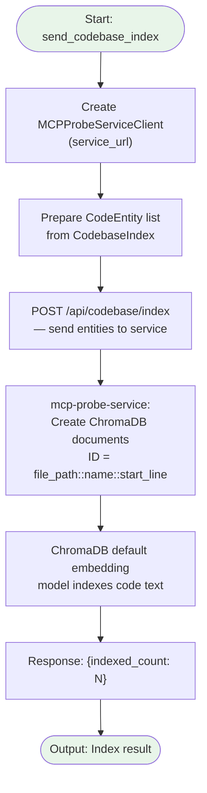

# Discovery Stage — Internal Flowchart

## Overview

The Discovery stage has three sub-stages that run sequentially: **MCP Server Discovery**, **AST Codebase Indexing**, and **Codebase Index Upload**. Together they build a complete picture of the target server's public interface and internal implementation.

## MCP Server Discovery Flow

```mermaid
flowchart TD
    Start([Start: run_discovery]) --> ParseCmd["Parse server_command via shlex.split()"]
    ParseCmd --> CreateParams["Create StdioServerParameters\n(command, args, env, cwd)"]
    CreateParams --> SpawnProc["Spawn server subprocess\nvia stdio_client()"]
    SpawnProc --> Timeout1{Timeout?}
    Timeout1 -- Yes --> ConnErr([MCPConnectionError:\nTimed out])
    Timeout1 -- No --> EstablishSession["Establish ClientSession\nover stdio read/write pipes"]
    EstablishSession --> Initialize["session.initialize()\n— MCP protocol handshake"]
    Initialize --> Timeout2{Timeout?}
    Timeout2 -- Yes --> Disconnect["disconnect() — cleanup"] --> ConnErr
    Timeout2 -- No --> StoreInit["Store _init_result\n(server info + capabilities)"]

    StoreInit --> ParseInfo["parse_server_info()\n— Extract ServerInfo from init_result"]
    ParseInfo --> ExtractCaps["Extract ServerCapabilities\n(tools, resources, prompts,\nsampling, logging)"]

    ExtractCaps --> DiscTools["discover_tools()\n— session.list_tools()"]
    DiscTools --> MapTools["Map each tool → ToolInfo\n(name, description, inputSchema)"]

    MapTools --> DiscRes["discover_resources()"]
    DiscRes --> ListStatic["session.list_resources()\n— static resources"]
    ListStatic --> MapStatic["Map each → ResourceInfo\n(uri, name, desc, mimeType,\nis_template=False)"]
    MapStatic --> ListTemplates["session.list_resource_templates()\n— URI templates"]
    ListTemplates --> TemplateOk{Success?}
    TemplateOk -- Yes --> MapTemplates["Map each → ResourceInfo\n(uriTemplate, is_template=True)"]
    TemplateOk -- No --> SkipTemplates["Skip — templates optional"]
    MapTemplates --> MergeRes["Merge static + template resources"]
    SkipTemplates --> MergeRes

    MergeRes --> DiscPrompts["discover_prompts()\n— session.list_prompts()"]
    DiscPrompts --> MapPrompts["Map each → PromptInfo\n(name, desc, arguments[])"]
    MapPrompts --> ForArgs["For each argument → PromptArgument\n(name, description, required)"]

    ForArgs --> Aggregate["Aggregate into DiscoveryResult\n(server_info, tools[],\nresources[], prompts[])"]
    Aggregate --> DisconnectOk["disconnect() — close session\n+ kill subprocess"]
    DisconnectOk --> EndDisc([Output: DiscoveryResult])

    style Start fill:#e8f5e9
    style EndDisc fill:#e8f5e9
    style ConnErr fill:#ffcdd2
```

## AST Codebase Indexing Flow

```mermaid
flowchart TD
    Start([Start: index_directory]) --> ValidatePath{Path exists\nand is directory?}
    ValidatePath -- No --> PathErr([ASTIndexerError])
    ValidatePath -- Yes --> FindFiles["_find_python_files()\n— recursive rglob('*.py')"]

    FindFiles --> FilterLoop["For each .py file"]
    FilterLoop --> CheckExcludeDir{"Parent dir matches\nDEFAULT_EXCLUDE_DIRS?\n(__pycache__, .git, venv,\nfeatures, tests, ...)"}
    CheckExcludeDir -- Yes --> SkipFile["Skip file"]
    CheckExcludeDir -- No --> CheckExcludeFile{"Filename in\nDEFAULT_EXCLUDE_FILES?\n(__init__.py)"}
    CheckExcludeFile -- Yes --> SkipFile
    CheckExcludeFile -- No --> AddFile["Add to python_files list"]
    SkipFile --> MoreFiles{More files?}
    AddFile --> MoreFiles
    MoreFiles -- Yes --> FilterLoop
    MoreFiles -- No --> ProcessLoop["For each python_file"]

    ProcessLoop --> ComputeHash["_compute_file_hash()\n— SHA-256 of file contents"]
    ComputeHash --> StoreHash["Store hash in file_hashes dict"]
    StoreHash --> CheckChanged{"Hash == previous_hash\nfor this file?"}
    CheckChanged -- Yes --> SkipUnchanged["Skip — file unchanged\n(incremental indexing)"]
    CheckChanged -- No --> ParseAST["_parse_file()\n— ast.parse(source)"]

    ParseAST --> WalkAST["ast.walk(tree)\n— traverse all AST nodes"]
    WalkAST --> NodeType{Node type?}

    NodeType -- "FunctionDef/\nAsyncFunctionDef" --> FindParent["_find_parent_class()\n— check if method or function"]
    FindParent --> ExtractFunc["_extract_entity()\n— entity_type: function/method"]

    NodeType -- ClassDef --> ExtractClass["_extract_entity()\n— entity_type: class"]

    NodeType -- Other --> NextNode["Continue walking"]

    ExtractFunc --> BuildEntity["Build CodeEntity:\n• file_path (relative)\n• entity_type\n• name\n• code (source lines)\n• start_line, end_line\n• docstring\n• decorators\n• parent_class"]
    ExtractClass --> BuildEntity

    BuildEntity --> AddEntity["Add to entities list"]
    AddEntity --> NextNode
    NextNode --> MoreNodes{More nodes?}
    MoreNodes -- Yes --> NodeType
    MoreNodes -- No --> MoreProcFiles{More files\nto process?}

    SkipUnchanged --> MoreProcFiles
    MoreProcFiles -- Yes --> ProcessLoop
    MoreProcFiles -- No --> BuildIndex["Build CodebaseIndex\n(entities[], file_hashes{},\ntotal_files, total_entities)"]
    BuildIndex --> EndAST([Output: CodebaseIndex])

    style Start fill:#e8f5e9
    style EndAST fill:#e8f5e9
    style PathErr fill:#ffcdd2
```

## Codebase Index Upload Flow

