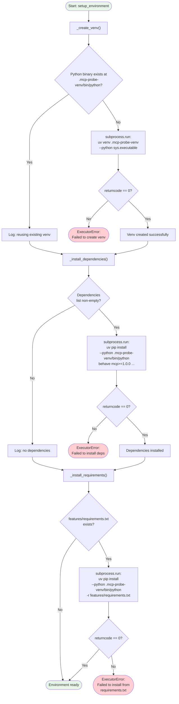
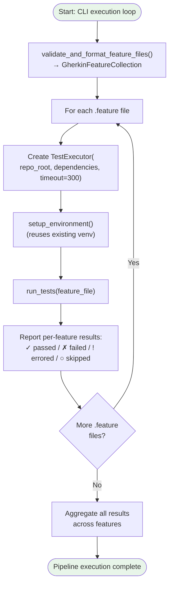

# Executor Stage — Internal Flowchart

## Overview

The Executor creates an isolated virtual environment, installs all test dependencies, runs `behave` against each generated `.feature` file, and parses the JSON output into structured results. All test execution is fully deterministic with no LLM calls at runtime.

## Environment Setup Flow

## Test Execution Flow

```mermaid
flowchart TD
    Start([Start: run_tests]) --> CheckPython{Venv python\nexists?}
    CheckPython -- No --> NoVenvErr([ExecutorError:\nCall setup_environment first])
    CheckPython -- Yes --> CheckFeatures{features/ directory\nexists?}
    CheckFeatures -- No --> NoFeatErr([ExecutorError:\nFeatures directory not found])
    CheckFeatures -- Yes --> CleanResults["Delete previous\ntest-results.json\nif exists"]

    CleanResults --> SetTarget{"feature_file\nprovided?"}
    SetTarget -- Yes --> SingleTarget["target = feature_file path"]
    SetTarget -- No --> AllTarget["target = features/ directory"]

    SingleTarget --> BuildEnv
    AllTarget --> BuildEnv

    BuildEnv["_build_env():\n• Copy os.environ\n• Set VIRTUAL_ENV = .mcp-probe-venv\n• Prepend .mcp-probe-venv/bin to PATH"]

    BuildEnv --> RunBehave["subprocess.run:\npython -m behave <target>\n--format json\n--outfile test-results.json\n--no-capture\n\ncwd = repo_root\ntimeout = 300s\nenv = built environment"]

    RunBehave --> TimedOut{TimeoutExpired?}
    TimedOut -- Yes --> TimeoutResult["Return TestExecutionResult:\nsuccess=False\nstderr='timed out after 300s'"]

    TimedOut -- No --> CheckExit{"returncode\n!= 0?"}
    CheckExit -- Yes --> LogWarning["Log: behave exited\nwith non-zero code\n(test failures, not fatal)"]
    CheckExit -- No --> ParseResults

    LogWarning --> ParseResults

    ParseResults["_parse_results(proc)"]
    ParseResults --> ReadJSON{"test-results.json\nexists?"}
    ReadJSON -- Yes --> LoadJSON["json.loads(file content)"]
    ReadJSON -- No --> EmptyJSON["raw_json = []"]

    LoadJSON --> ParseOk{Valid JSON?}
    ParseOk -- No --> EmptyJSON
    ParseOk -- Yes --> IterateFeatures

    EmptyJSON --> IterateFeatures

    IterateFeatures["For each feature in JSON"]
    IterateFeatures --> IterateElements["For each element\n(type == 'scenario')"]
    IterateElements --> IterateSteps["For each step in scenario"]

    IterateSteps --> CheckStepStatus{"step result\nstatus?"}
    CheckStepStatus -- passed --> AccumDuration["Accumulate duration"]
    CheckStepStatus -- failed --> MarkFailed["scenario_status = 'failed'"]
    CheckStepStatus -- "undefined/error" --> MarkErrored["scenario_status = 'errored'"]
    CheckStepStatus -- skipped --> MarkSkipped["scenario_status = 'skipped'\n(only if still 'passed')"]

    AccumDuration --> MoreSteps{More steps?}
    MarkFailed --> MoreSteps
    MarkErrored --> MoreSteps
    MarkSkipped --> MoreSteps
    MoreSteps -- Yes --> IterateSteps
    MoreSteps -- No --> TallyScenario{"scenario_status?"}

    TallyScenario -- passed --> IncPassed["passed += 1"]
    TallyScenario -- failed --> IncFailed["failed += 1"]
    TallyScenario -- errored --> IncErrored["errored += 1"]
    TallyScenario -- skipped --> IncSkipped["skipped += 1"]

    IncPassed --> MoreElements{More scenarios?}
    IncFailed --> MoreElements
    IncErrored --> MoreElements
    IncSkipped --> MoreElements
    MoreElements -- Yes --> IterateElements
    MoreElements -- No --> MoreFeatureBlocks{More features?}
    MoreFeatureBlocks -- Yes --> IterateFeatures
    MoreFeatureBlocks -- No --> BuildResult

    BuildResult["Build TestExecutionResult:\n• success (returncode == 0)\n• total_scenarios\n• passed, failed, errored, skipped\n• duration (total accumulated)\n• raw_json (preserved)\n• output_file path\n• stdout, stderr"]

    BuildResult --> End([Output: TestExecutionResult])
    TimeoutResult --> End

    style Start fill:#e8f5e9
    style End fill:#e8f5e9
    style NoVenvErr fill:#ffcdd2
    style NoFeatErr fill:#ffcdd2
```

## Per-Feature Execution Loop (CLI Level)

