# Planner Stage — Internal Flowchart

## Overview

The Planner stage generates test scenario titles (not full Gherkin) via LLM structured output. It has two sub-stages: **Unit Test Planning** (per-primitive) and **Integration Test Planning** (cross-primitive workflows).

## Unit Test Planning Flow

```mermaid
flowchart TD
    Start([Start: run_unit_test_planning]) --> CreateLLM["Create LLMClient()\n— Gemini 2.5 Flash"]
    CreateLLM --> CreatePlanner["Create Planner(llm)"]
    CreatePlanner --> ToolLoop["For each discovered Tool"]

    ToolLoop --> BuildToolPrompt["Build ChatPromptTemplate:\n• system: TOOL_UNIT_SYSTEM\n  (QA Lead role, coverage rules)\n• human: TOOL_UNIT_HUMAN\n  (tool_name, description, input_schema)"]
    BuildToolPrompt --> ChainTool["Create chain:\nprompt | llm.with_structured_output(\n  _ScenarioListOutput)"]
    ChainTool --> InvokeTool["chain.invoke({\n  tool_name, tool_description,\n  input_schema})"]
    InvokeTool --> ParseTool["Parse _ScenarioListOutput:\nvalidated list of scenario title strings"]
    ParseTool --> MapTool["Map each title → ScenarioPlan\n(scenario=title,\n primitives=[tool.name])"]
    MapTool --> MoreTools{More tools?}
    MoreTools -- Yes --> ToolLoop
    MoreTools -- No --> ResLoop["For each discovered Resource"]

    ResLoop --> BuildResPrompt["Build ChatPromptTemplate:\n• system: RESOURCE_UNIT_SYSTEM\n• human: RESOURCE_UNIT_HUMAN\n  (uri, name, desc, mime_type, is_template)"]
    BuildResPrompt --> ChainRes["Create chain:\nprompt | llm.with_structured_output(\n  _ScenarioListOutput)"]
    ChainRes --> InvokeRes["chain.invoke({\n  resource_uri, resource_name,\n  resource_description,\n  mime_type, is_template})"]
    InvokeRes --> ParseRes["Parse _ScenarioListOutput"]
    ParseRes --> MapRes["Map each title → ScenarioPlan\n(scenario=title,\n primitives=[resource_name])"]
    MapRes --> MoreRes{More resources?}
    MoreRes -- Yes --> ResLoop
    MoreRes -- No --> PromptLoop["For each discovered Prompt"]

    PromptLoop --> BuildPrPrompt["Build ChatPromptTemplate:\n• system: PROMPT_UNIT_SYSTEM\n• human: PROMPT_UNIT_HUMAN\n  (prompt_name, description, arguments)"]
    BuildPrPrompt --> FormatArgs["Format arguments string:\nname (required/optional), ..."]
    FormatArgs --> ChainPr["Create chain:\nprompt | llm.with_structured_output(\n  _ScenarioListOutput)"]
    ChainPr --> InvokePr["chain.invoke({\n  prompt_name, prompt_description,\n  arguments})"]
    InvokePr --> ParsePr["Parse _ScenarioListOutput"]
    ParsePr --> MapPr["Map each title → ScenarioPlan\n(scenario=title,\n primitives=[prompt.name])"]
    MapPr --> MorePr{More prompts?}
    MorePr -- Yes --> PromptLoop
    MorePr -- No --> GroupResults["Group all ScenarioPlan lists\nby primitive type into\nUnitTestPlanResult"]
    GroupResults --> EndUnit([Output: UnitTestPlanResult\n— tool/resource/prompt scenario lists])

    style Start fill:#e8f5e9
    style EndUnit fill:#e8f5e9
```



## Integration Test Planning Flow

```mermaid
flowchart TD
    Start([Start: run_integration_test_planning]) --> CreateLLM["Create LLMClient()\n— Gemini 2.5 Flash"]
    CreateLLM --> CreatePlanner["Create Planner(llm)"]
    CreatePlanner --> SumTools["_summarise_tools(discovery)\n— Format each tool: name, desc, schema"]
    SumTools --> SumRes["_summarise_resources(discovery)\n— Format each resource: name/uri, desc,\nmime_type, template flag"]
    SumRes --> SumPrompts["_summarise_prompts(discovery)\n— Format each prompt: name, desc,\nargs (name, required/optional)"]

    SumPrompts --> BuildPrompt["Build ChatPromptTemplate:\n• system: INTEGRATION_SYSTEM\n  (QA Lead, identify workflows)\n• human: INTEGRATION_HUMAN\n  (tools, resources, prompts summaries)"]
    BuildPrompt --> Chain["Create chain:\nprompt | llm.with_structured_output(\n  IntegrationTestPlanResult)"]
    Chain --> Invoke["chain.invoke({\n  tools_summary,\n  resources_summary,\n  prompts_summary})"]

    Invoke --> ParseResult["Parse IntegrationTestPlanResult:\nList of integration_scenarios,\neach with:"]
    ParseResult --> ScenarioFields["• scenario (title string)\n• pattern (chain-of-thought |\n  resource-augmented |\n  prompt-driven)\n• primitives (list of involved\n  MCP primitive names)"]

    ScenarioFields --> Identify["LLM identifies 3 workflow patterns:\n1. Chain-of-Calls: Tool A → Tool B\n2. Resource-Augmented: Tool → Resource read\n3. Prompt-Driven: Prompt → Tool call"]
    Identify --> EndInteg([Output: IntegrationTestPlanResult\n— integration_scenarios[]])

    style Start fill:#e8f5e9
    style EndInteg fill:#e8f5e9
```
