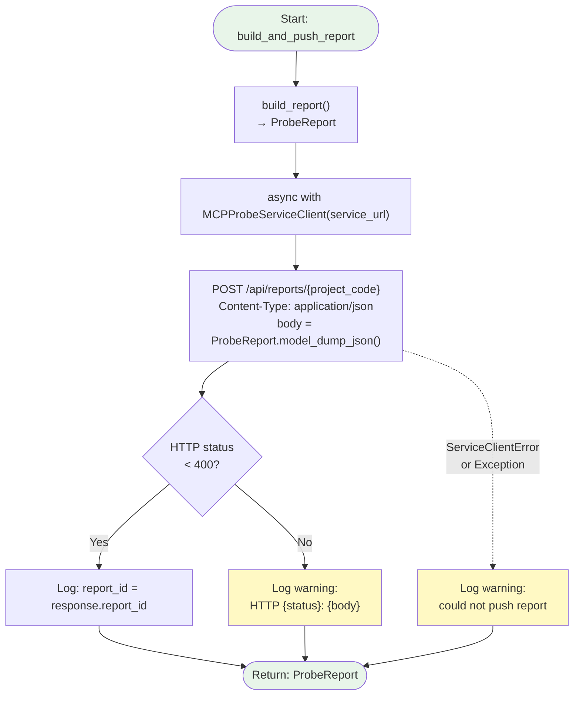
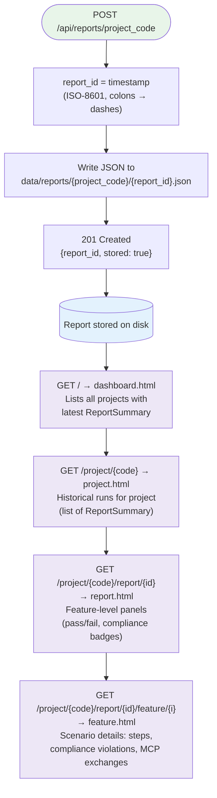

# Report Builder — Internal Flowchart

## Overview

The Report Builder correlates three data sources by `(feature_name, scenario_name)` to produce a unified `ProbeReport`, then pushes it to the mcp-probe-service for persistent storage and visualization. No LLM calls are involved — this is pure data assembly.

## Report Build Flow

```mermaid
flowchart TD
    Start([Start: build_report]) --> LoadResults{"test-results.json\nexists?"}
    LoadResults -- Yes --> ParseResults["json.loads(test-results.json)\n→ behave_features list"]
    LoadResults -- No --> EmptyResults["behave_features = []\n(log warning)"]
    ParseResults --> LoadTraffic
    EmptyResults --> LoadTraffic

    LoadTraffic{"mcp-traffic.json\nexists?"}
    LoadTraffic -- Yes --> ParseTraffic["json.loads(mcp-traffic.json)\n→ traffic_scenarios list"]
    LoadTraffic -- No --> EmptyTraffic["traffic_scenarios = []\n(log warning)"]
    ParseTraffic --> IndexCompliance
    EmptyTraffic --> IndexCompliance

    IndexCompliance["Index ComplianceReport\nby (feature_name, scenario_name)\n→ compliance_map dict"]
    IndexCompliance --> IndexTraffic["Index traffic exchanges\nby (feature_name, scenario_name)\n→ traffic_map dict"]
    IndexTraffic --> IterFeatures

    IterFeatures["For each behave feature"]
    IterFeatures --> IterScenarios["For each element\nwhere type == 'scenario'"]

    IterScenarios --> DeriveStatus["_derive_scenario_status(steps)\n→ passed | failed | errored | skipped"]
    DeriveStatus --> BuildSteps["_build_step_results(steps)\n→ list of StepResult"]
    BuildSteps --> LookupCompliance["compliance_map.get(\nfeature_name, scenario_name)"]
    LookupCompliance --> BuildCompliance["_build_compliance_detail()\n→ ScenarioComplianceDetail"]
    BuildCompliance --> LookupTraffic["traffic_map.get(\nfeature_name, scenario_name)"]
    LookupTraffic --> BuildExchanges["_build_exchanges()\n→ list of Exchange"]
    BuildExchanges --> AppendScenario["Append ScenarioReport\n(status, steps, compliance, exchanges)"]

    AppendScenario --> MoreScenarios{More scenarios\nin this feature?}
    MoreScenarios -- Yes --> IterScenarios
    MoreScenarios -- No --> BuildFeature["Build FeatureReport\n(summary_test_passed, mcp_compliant,\nduration, passed/failed counts)"]

    BuildFeature --> MoreFeatures{More behave\nfeatures?}
    MoreFeatures -- Yes --> IterFeatures
    MoreFeatures -- No --> Aggregate["Aggregate totals:\ntotal_scenarios, passed, failed\nall_tests_passed, all_compliant"]

    Aggregate --> BuildReport["Build ProbeReport(\nproject_code, timestamp,\nsummary_test_passed, mcp_compliant,\nspec_version, feature_reports)"]
    BuildReport --> End([Output: ProbeReport])

    style Start fill:#e8f5e9
    style End fill:#e8f5e9
```

## Report Push Flow

## Service-Side Report Storage & Visualization

