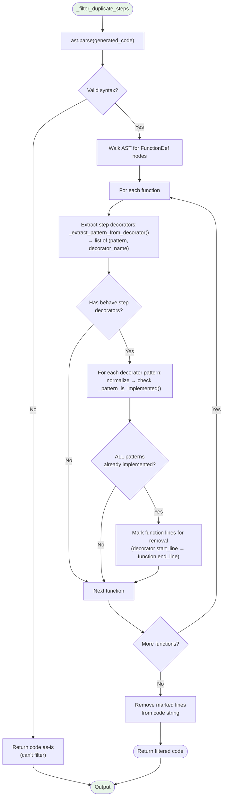
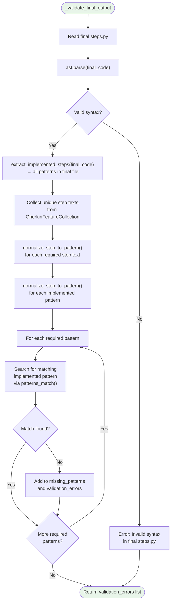
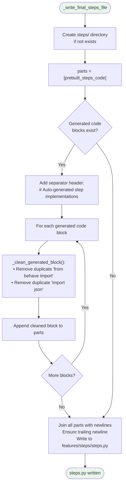

# Step Implementation Generator — Internal Flowchart

## Overview

The Step Implementation Generator bridges the gap between generated Gherkin feature files and executable test code. It uses AST-based deduplication to identify which steps already have implementations in the prebuilt `steps.py`, then uses an LLM to generate Python code only for missing steps.

## Main Orchestration Flow

```mermaid
flowchart TD
    Start([Start: generate_all]) --> DownloadPrebuilts["Download prebuilt scaffolding\nfrom mcp-probe-service:\n• steps/steps.py\n• helper/mcp_client.py\n• environment.py\n• requirements.txt"]
    DownloadPrebuilts --> ParsePrebuilt["extract_implemented_steps(prebuilt_code)\n— AST parse prebuilt steps.py"]
    ParsePrebuilt --> ExtractPatterns["Walk AST, find FunctionDef nodes\nwith @given/@when/@then decorators\n→ dict[pattern_string, set(decorator_names)]"]
    ExtractPatterns --> LogPatterns["Log all prebuilt patterns\nwith their normalized forms"]

    LogPatterns --> FeatureLoop["For each Feature in\nGherkinFeatureCollection"]
    FeatureLoop --> ScenarioLoop["For each Scenario in Feature"]
    ScenarioLoop --> GetMissing["_get_missing_steps(scenario)"]

    GetMissing --> StepLoop["For each step in scenario"]
    StepLoop --> Normalize["normalize_step_to_pattern(step.text):\n1. Replace JSON arrays → {json_value}\n2. Replace {name:d}/{name:int} → {number}\n3. Replace \"quoted\" → \"{placeholder}\"\n4. Replace {name} → {placeholder}\n5. Replace bare integers → {number}"]
    Normalize --> CheckImpl["_pattern_is_implemented(pattern)"]

    CheckImpl --> MatchLoop["For each implemented pattern"]
    MatchLoop --> NormalizeImpl["normalize_step_to_pattern(\nimpl_pattern)"]
    NormalizeImpl --> PatternsMatch["patterns_match(impl, required):\n1. Case-insensitive exact match?\n2. Convert to generic form:\n   {number} → {placeholder}\n   \"{placeholder}\" → {placeholder}\n   {json_value} → {placeholder}\n3. Compare generic forms"]
    PatternsMatch --> MatchResult{Match found?}
    MatchResult -- Yes --> StepImplemented["Step is implemented ✓"]
    MatchResult -- No --> MoreImpl{More impl\npatterns?}
    MoreImpl -- Yes --> MatchLoop
    MoreImpl -- No --> StepMissing["Add to missing_steps list"]

    StepImplemented --> MoreSteps{More steps?}
    StepMissing --> MoreSteps
    MoreSteps -- Yes --> StepLoop
    MoreSteps -- No --> AnyMissing{Missing\nsteps found?}

    AnyMissing -- No --> SkipScenario["Skip scenario\nsteps_skipped += count"]
    AnyMissing -- Yes --> GenerateForScenario["_generate_for_scenario(\nscenario, feature_name,\nmissing_steps)"]

    GenerateForScenario --> GenResult
    SkipScenario --> MoreScenarios

    GenResult{Generation\nsucceeded?}
    GenResult -- Yes --> FilterDups["_filter_duplicate_steps(\ngenerated_code)"]
    GenResult -- No --> LogError["Log error to\nvalidation_errors"]
    LogError --> MoreScenarios

    FilterDups --> HasNew{Filtered code\nnon-empty?}
    HasNew -- Yes --> StoreBlock["Append to _generated_code_blocks\nMerge new patterns into\n_implemented_patterns"]
    HasNew -- No --> LogDupSkip["Log: all generated steps\nwere duplicates"]
    StoreBlock --> MoreScenarios
    LogDupSkip --> MoreScenarios

    MoreScenarios{More scenarios?}
    MoreScenarios -- Yes --> ScenarioLoop
    MoreScenarios -- No --> MoreFeatures{More features?}
    MoreFeatures -- Yes --> FeatureLoop
    MoreFeatures -- No --> WriteFinal["_write_final_steps_file()"]

    WriteFinal --> ValidateFinal["_validate_final_output(\nfeature_collection)"]
    ValidateFinal --> End([Output: StepImplementationResult\n— steps_generated, steps_skipped,\nvalidation_errors])

    style Start fill:#e8f5e9
    style End fill:#e8f5e9
```

## LLM Generation for a Single Scenario

```mermaid
flowchart TD
    Start([_generate_for_scenario]) --> FormatScenario["_format_scenario_text(scenario):\nBuild Gherkin text with step types,\ndata tables, and indentation"]
    FormatScenario --> FormatExisting["_format_existing_steps_list():\nList all implemented patterns as\n- @decorator('pattern')"]

    FormatExisting --> RenderSystem["Render STEP_IMPL_SYSTEM_TEMPLATE:\n• Architecture rules\n  (error capture pattern,\n   context management)\n• Already-implemented step list\n  (prevent duplication)"]
    RenderSystem --> RenderHuman["Render STEP_IMPL_HUMAN_TEMPLATE:\n• feature_name\n• scenario_name\n• scenario_text (full Gherkin)"]

    RenderHuman --> Attempt["attempt = 0"]
    Attempt --> CallLLM["_call_llm():\nSend [SystemMessage, HumanMessage]\nto Gemini 2.5 Flash"]
    CallLLM --> ExtractCode["_extract_python_code(response):\nExtract from ```python...``` block\nRemove # EOF marker"]
    ExtractCode --> ExtractOk{Code block\nfound?}
    ExtractOk -- No --> ExtractErr["StepImplementationError:\nNo valid Python code block"]
    ExtractOk -- Yes --> ParseAST["ast.parse(code)\n— validate Python syntax"]
    ParseAST --> SyntaxOk{Valid syntax?}
    SyntaxOk -- Yes --> ReturnCode([Return generated code])
    SyntaxOk -- No --> RetryCheck{attempt <\nMAX_RETRIES (2)?}
    ExtractErr --> RetryCheck
    RetryCheck -- Yes --> IncAttempt["attempt += 1"] --> CallLLM
    RetryCheck -- No --> FinalErr([StepImplementationError:\nFailed after 3 attempts])

    style Start fill:#e8f5e9
    style ReturnCode fill:#e8f5e9
    style FinalErr fill:#ffcdd2
```

## Duplicate Filtering Flow



## Final Validation Flow



## File Output Flow


