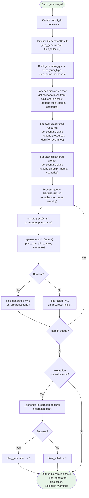
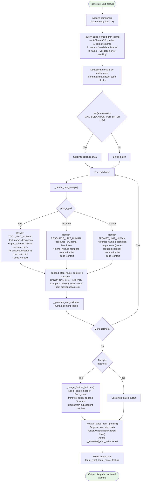
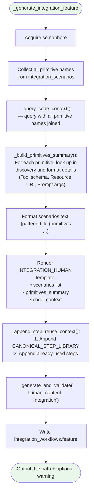

# Test Scenario Generator (GherkinFeatureGenerator) — Internal Flowchart

## Overview

The Test Scenario Generator expands scenario titles from the Planner into complete, executable Gherkin `.feature` files. It uses LLM-driven synthesis constrained by the Canonical Step Library, with code context retrieved from ChromaDB.

## Main Orchestration Flow



## Unit Feature Generation Flow



## LLM Generation and Validation Flow

```mermaid
flowchart TD
    Start([_generate_and_validate]) --> InitRetry["attempt = 0\nMAX_RETRIES = 1"]
    InitRetry --> CallLLM["_call_llm(human_content):\n1. Render SYSTEM_PROMPT with server_command\n2. Build [SystemMessage, HumanMessage]\n3. llm.ainvoke(messages)\n4. Return raw response text"]
    CallLLM --> ProcessOutput["_process_llm_output(raw_response, label)"]

    ProcessOutput --> ExtractGherkin["_extract_gherkin(raw_response)"]
    ExtractGherkin --> TryCodeBlock{"Contains\n```gherkin\\n...``` ?"}
    TryCodeBlock -- Yes --> ExtractFromGherkinBlock["Extract content from\ngherkin code block"]
    TryCodeBlock -- No --> TryGenericBlock{"Contains\n```\\n...``` ?"}
    TryGenericBlock -- Yes --> ExtractFromGenericBlock["Extract content from\ngeneric code block"]
    TryGenericBlock -- No --> TryRawGherkin{"Starts with\nFeature: or @?"}
    TryRawGherkin -- Yes --> UseRawContent["Use cleaned content directly"]
    TryRawGherkin -- No --> NoGherkin([GherkinGenerationError:\nNo Gherkin content found])

    ExtractFromGherkinBlock --> CheckEndMarker
    ExtractFromGenericBlock --> CheckEndMarker
    UseRawContent --> CheckEndMarker

    CheckEndMarker{"[END_OF_FEATURE]\nmarker present?"}
    CheckEndMarker -- No --> TrimLast["_remove_last_scenario():\nDrop final Scenario block\n(assumed incomplete)\n+ Set warning"]
    CheckEndMarker -- Yes --> ValidateSyntax

    TrimLast --> ValidateSyntax["_validate_gherkin():\nParse with gherkin-official\nParser()"]
    ValidateSyntax --> SyntaxOk{Valid syntax?}
    SyntaxOk -- No --> RetryCheck{attempt <\nMAX_RETRIES?}
    RetryCheck -- Yes --> IncAttempt["attempt += 1"] --> CallLLM
    RetryCheck -- No --> SyntaxErr([GherkinGenerationError:\nSyntax validation failed])

    SyntaxOk -- Yes --> ValidateRefs["_validate_primitive_references():\nCheck tool/resource/prompt names\nagainst DiscoveryResult"]
    ValidateRefs --> RefsOk{All references\nvalid?}
    RefsOk -- Yes --> ReturnOk
    RefsOk -- No --> StripInvalid["_strip_invalid_scenarios():\nRemove scenarios with\nunknown tool/prompt names\n(keep invalid resource URIs\nfor error-case tests)"]
    StripInvalid --> SetRefWarning["Set reference warning"]
    SetRefWarning --> ReturnOk

    ReturnOk([Output: (gherkin_content, warning)])

    style Start fill:#e8f5e9
    style ReturnOk fill:#e8f5e9
    style NoGherkin fill:#ffcdd2
    style SyntaxErr fill:#ffcdd2
```

## Integration Feature Generation Flow


