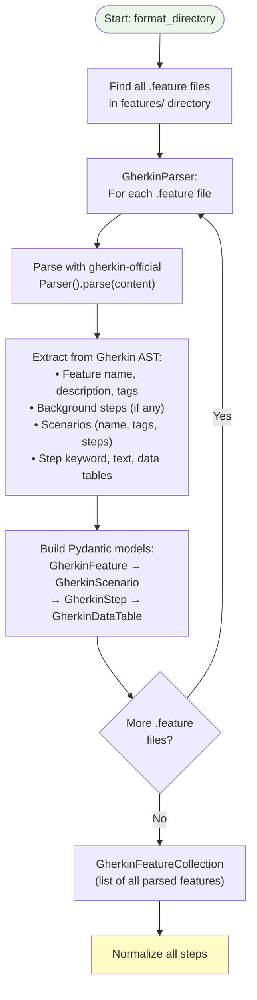
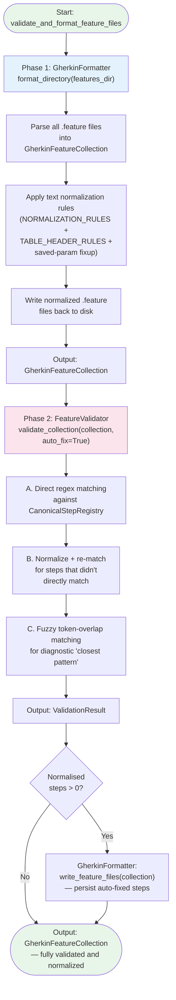

# Validator Stage — Internal Flowchart

## Overview

The Validator stage is a two-phase pipeline that ensures LLM-generated Gherkin features use only canonical step patterns. **Phase 1 (GherkinFormatter)** applies text normalization rules to fix known LLM variations. **Phase 2 (FeatureValidator)** performs canonical compliance checking with direct matching, normalization, and fuzzy matching.

## Phase 1: GherkinFormatter — Text Normalization

### Parse Flow



### Normalization Flow

```mermaid
flowchart TD
    Start([Normalize all steps]) --> FeatureLoop["For each Feature\nin collection"]
    FeatureLoop --> ScenarioLoop["For each Scenario"]
    ScenarioLoop --> StepLoop["For each Step"]

    StepLoop --> ApplyRules["StepNormalizer.normalize_step():\nApply NORMALIZATION_RULES\nin order (most specific first)"]
    ApplyRules --> Rule1["'the response contains a'\n→ 'the response should contain'"]
    Rule1 --> Rule2["'the response should be unsuccessful'\n→ 'the response should be a failure'"]
    Rule2 --> Rule3["'the response field X should equal'\n→ 'the response field X should be'"]
    Rule3 --> Rule4["'the error should indicate'\n→ 'the error message should indicate'"]
    Rule4 --> Rule5["Unquoted booleans:\n'with value True' → 'with value \"True\"'"]
    Rule5 --> MoreRules["... remaining rules"]

    MoreRules --> CheckTable{"Step has\ndata table?"}
    CheckTable -- Yes --> NormHeaders["Apply TABLE_HEADER_RULES:\n'parameter_name' → 'parameter'\n'param' → 'parameter'\n'param_value' → 'value'"]
    CheckTable -- No --> CheckSaved

    NormHeaders --> CheckSaved["_fixup_saved_param_table():\nIf step says 'with parameters'\nbut table has {var} literals,\nconvert to 'with saved parameters'\nand adjust headers"]

    CheckSaved --> UpdateStep["Update step.text\nif changed"]
    UpdateStep --> MoreSteps{More steps?}
    MoreSteps -- Yes --> StepLoop
    MoreSteps -- No --> MoreScenarios{More scenarios?}
    MoreScenarios -- Yes --> ScenarioLoop
    MoreScenarios -- No --> MoreFeatures{More features?}
    MoreFeatures -- Yes --> FeatureLoop
    MoreFeatures -- No --> WriteBack["Write normalized .feature\nfiles back to disk"]
    WriteBack --> End([Output: GherkinFeatureCollection\n— normalized])

    style Start fill:#fff9c4
    style End fill:#e8f5e9
```

## Phase 2: FeatureValidator — Canonical Compliance

### Registry Construction Flow

```mermaid
flowchart TD
    Start([CanonicalStepRegistry.__init__]) --> LoadPatterns["Load CANONICAL_PATTERNS\nfrom core.canonical_steps\n— list of (keyword, step_text) tuples"]
    LoadPatterns --> PatternLoop["For each (keyword, step_text)"]
    PatternLoop --> EscapeText["re.escape(step_text)\n— escape all regex metacharacters"]
    EscapeText --> RestorePlaceholders["Restore placeholder tokens\nthat re.escape mangled"]

    RestorePlaceholders --> QuotedPH["Replace \\\"\\{...\\}\\\" patterns\n→ \"([^\"]+)\"\n(quoted string capture group)"]
    QuotedPH --> IntPH["Replace \\{...:d\\} patterns\n→ (\\d+)\n(integer capture group)"]
    IntPH --> BarePH["Replace \\{...\\} patterns\n→ (.+)\n(greedy capture group)"]
    BarePH --> LiteralBrackets["Preserve literal \\[\\]\n(empty list assertion)"]
    LiteralBrackets --> CompileRegex["Compile: re.compile(\n'^' + pattern + '$',\nre.IGNORECASE)"]
    CompileRegex --> StoreTriple["Store (keyword, compiled_regex,\noriginal_text)"]
    StoreTriple --> MorePatterns{More patterns?}
    MorePatterns -- Yes --> PatternLoop
    MorePatterns -- No --> End([Registry ready:\nlist of compiled matchers])

    style Start fill:#e8f5e9
    style End fill:#e8f5e9
```

### Validation Flow

```mermaid
flowchart TD
    Start([Start: validate_collection]) --> InitResult["Initialize ValidationResult:\ntotal_features, total_steps,\ncompliant, normalised, rejected = 0"]
    InitResult --> FeatureLoop["For each Feature"]
    FeatureLoop --> InitFeatResult["Initialize FeatureValidationResult"]
    InitFeatResult --> GetAllSteps["feature.get_all_steps()\n— collect from Background\n+ all Scenarios"]
    GetAllSteps --> StepLoop["For each Step"]

    StepLoop --> ValidateStep["_validate_step(step, auto_fix)"]
    ValidateStep --> CleanText["Clean step text:\nstrip whitespace"]

    CleanText --> DirectMatch["Phase A: Direct Match\nregistry.match(text)\n— test against ALL compiled\ncanonical regex patterns"]
    DirectMatch --> DirectOk{Match found?}
    DirectOk -- Yes --> Compliant["StepComplianceResult:\nstatus = COMPLIANT\nmatched_pattern = canonical text"]

    DirectOk -- No --> Normalise["Phase B: Normalise\nnormaliser.normalise(text)\n— apply NORMALIZATION_RULES"]
    Normalise --> NormEmpty{Normalized to\nempty string?}
    NormEmpty -- Yes --> RejectEmpty["StepComplianceResult:\nstatus = REJECTED\nreason = 'LLM-dependent step'"]

    NormEmpty -- No --> NormChanged{Text changed\nafter normalization?}
    NormChanged -- Yes --> ReMatch["registry.match(normalised_text)\n— re-test against canonical patterns"]
    ReMatch --> ReMatchOk{Match found?}
    ReMatchOk -- Yes --> AutoFix{"auto_fix\n= True?"}
    AutoFix -- Yes --> RewriteStep["Rewrite step.text = normalised\n(in-place modification)"]
    AutoFix -- No --> NormResult
    RewriteStep --> NormResult["StepComplianceResult:\nstatus = NORMALISED\nmatched_pattern = canonical text\nnormalised_text = new text"]

    NormChanged -- No --> FuzzyPhase
    ReMatchOk -- No --> FuzzyPhase

    FuzzyPhase["Phase C: Fuzzy Match\n_fuzzy_match(normalised_text)"]
    FuzzyPhase --> TokenOverlap["For each canonical pattern:\n1. Remove placeholders and quotes\n2. Tokenize (lowercase split)\n3. Compute token overlap score:\n   overlap / max(canon_tokens)"]
    TokenOverlap --> BestScore{Best score\n≥ 0.4?}
    BestScore -- Yes --> RejectWithHint["StepComplianceResult:\nstatus = REJECTED\nreason = 'Closest: <best_pattern>'"]
    BestScore -- No --> RejectNoHint["StepComplianceResult:\nstatus = REJECTED\nreason = 'No canonical match found'"]

    Compliant --> TallyStep
    RejectEmpty --> TallyStep
    NormResult --> TallyStep
    RejectWithHint --> TallyStep
    RejectNoHint --> TallyStep

    TallyStep["Tally: increment\ncompliant/normalised/rejected\ncounters"]
    TallyStep --> MoreSteps{More steps?}
    MoreSteps -- Yes --> StepLoop
    MoreSteps -- No --> AggregateFeat["Aggregate feature results\ninto ValidationResult"]
    AggregateFeat --> CollectRejected["Collect rejected steps\ninto rejected_steps list"]
    CollectRejected --> MoreFeatures{More features?}
    MoreFeatures -- Yes --> FeatureLoop
    MoreFeatures -- No --> LogSummary["Log: X steps —\nY compliant, Z normalised,\nW rejected"]
    LogSummary --> CheckValid{"rejected == 0?"}
    CheckValid -- Yes --> Valid["is_valid = True ✓"]
    CheckValid -- No --> Invalid["is_valid = False ✗"]
    Valid --> End
    Invalid --> End

    End([Output: ValidationResult\n— per-feature + aggregate stats,\nrejected_steps list])

    style Start fill:#e8f5e9
    style End fill:#e8f5e9
    style Compliant fill:#c8e6c9
    style NormResult fill:#fff9c4
    style RejectEmpty fill:#ffcdd2
    style RejectWithHint fill:#ffcdd2
    style RejectNoHint fill:#ffcdd2
```



## Combined Two-Phase Pipeline (Orchestrator Level)


