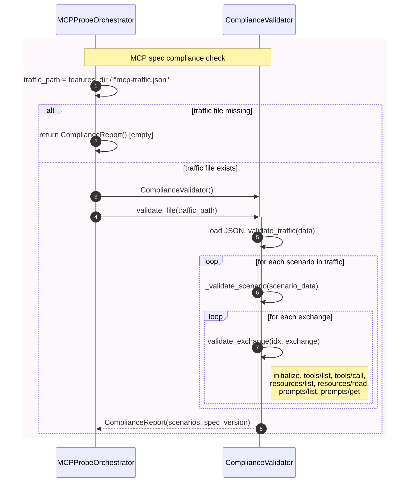

# Sequence Diagram — Compliance Validation

Minimum actors: **MCPProbeOrchestrator**, **ComplianceValidator**.

## Summary

| Step | Orchestrator action | Main interaction |
|------|---------------------|-------------------|
| **Validate** | Resolves `features/mcp-traffic.json` (written by behave hooks during test run). If missing, returns empty `ComplianceReport`. Otherwise creates `ComplianceValidator()` and calls `validate_file(traffic_path)`. | Validator loads the traffic JSON, validates each scenario’s exchanges against the MCP 2025-11-25 spec (request/response shapes, notifications, etc.), and returns a `ComplianceReport` with per-scenario results and violation details. |
