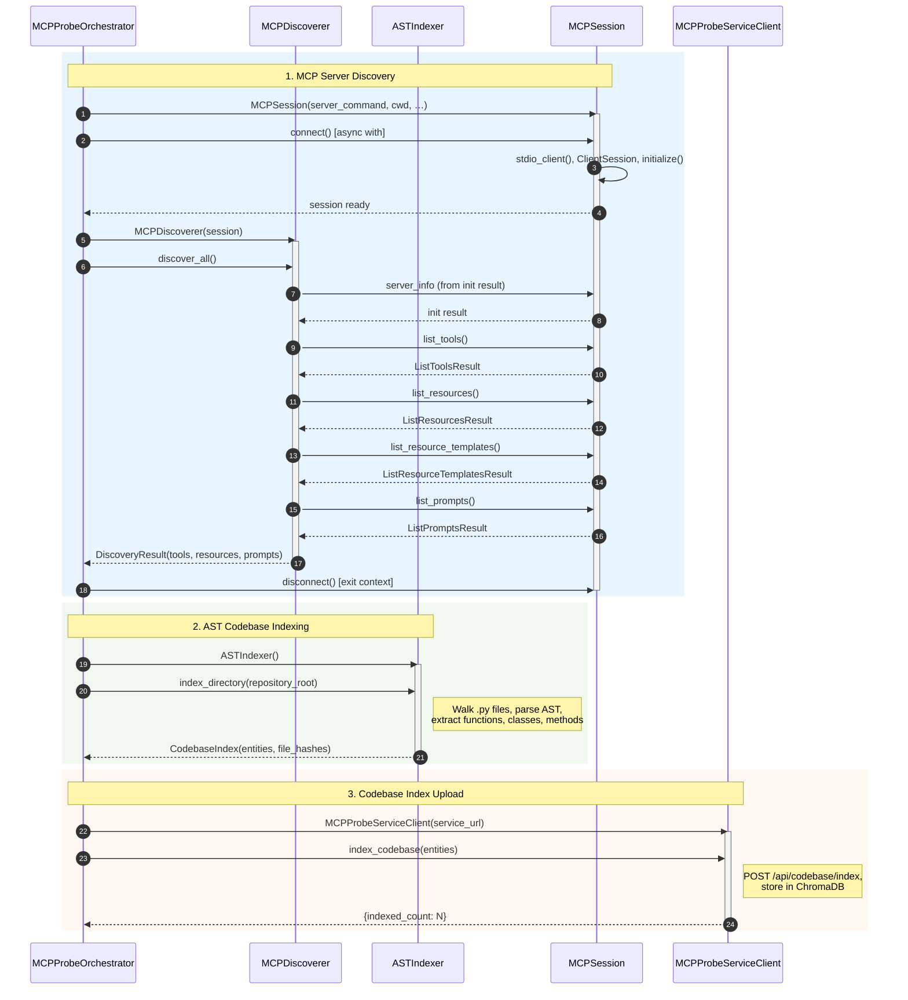

# Sequence Diagram — Discovery Stage

This diagram shows the Discovery Stage flow using only: **MCPProbeOrchestrator**, **MCPDiscoverer**, **ASTIndexer**, **MCPSession**, and **MCPProbeServiceClient**.

## Summary

| Step | Orchestrator action | Main interaction |
|------|---------------------|------------------|
| **1. MCP Server Discovery** | `async with MCPSession(...)` then `MCPDiscoverer(session).discover_all()` | Session: connect → list_tools, list_resources, list_resource_templates, list_prompts → disconnect. Discoverer maps MCP types to `DiscoveryResult`. |
| **2. AST Codebase Indexing** | `ASTIndexer().index_directory(repository_root)` | Indexer scans repo, parses Python ASTs, returns `CodebaseIndex`. |
| **3. Codebase Index Upload** | `async with MCPProbeServiceClient(...)` then `client.index_codebase(entities)` | Client POSTs entities to mcp-probe-service for ChromaDB indexing. |
