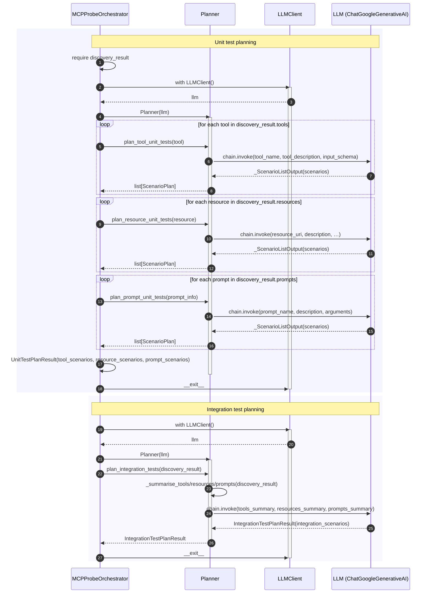

# Sequence Diagram — Planning Stage

This diagram shows the Planning Stage flow. The **core** participants are: **MCPProbeOrchestrator**, **Planner**, **LLMClient**, and **LLM** (ChatGoogleGenerativeAI), so that who drives planning, who performs it, who provides the model, and who is actually invoked are all visible.

## Summary

| Step | Orchestrator action | Main interaction |
|------|---------------------|------------------|
| **Unit test planning** | Requires `discovery_result`. `with LLMClient()` → `Planner(llm)`; for each tool/resource/prompt calls `plan_*_unit_tests(…)`. | Planner builds a prompt + structured-output chain and invokes the LLM per primitive; returns `list[ScenarioPlan]`. Orchestrator aggregates into `UnitTestPlanResult`. |
| **Integration test planning** | Same LLM context; calls `planner.plan_integration_tests(discovery_result)`. | Planner summarises discovery, invokes LLM once with structured output `IntegrationTestPlanResult`, returns it to Orchestrator. |

---

## Other classes you might include

You can extend the diagram with any of the following, depending on how much you want to show.

| Class | Why include it |
|-------|----------------|
| **DiscoveryResult** | Planning is entirely driven by discovery output: unit planning iterates over `discovery_result.tools`, `.resources`, `.prompts`, and integration planning takes the whole `DiscoveryResult` for summaries. Showing it as a participant (e.g. Orchestrator reading from it before each `plan_*` call) makes that data dependency explicit. |
| **UnitTestPlanResult** / **IntegrationTestPlanResult** | These are the main outputs of the stage. Usually they appear as return values in the diagram; adding them as participants is only useful if you want to emphasise that the orchestrator stores and later passes them to the Generation stage. |
| **ScenarioPlan** | The atomic unit of a plan (scenario title + primitives). Again, typically shown as payload in messages rather than as a lifeline, unless you want to highlight the shape of the data. |
| **Prompts** (e.g. `plan/prompts.py` constants) | The Planner uses `TOOL_UNIT_SYSTEM`, `TOOL_UNIT_HUMAN`, `RESOURCE_*`, `PROMPT_*`, `INTEGRATION_*` to build the chat prompt. Including “Prompts” as a participant could show that the Planner “reads” prompt templates before each LLM call, if you want to document prompt provenance. |

If you tell me which of these you want in the diagram (e.g. “add DiscoveryResult and the two result types”), I can update the sequence diagram to include them explicitly.
