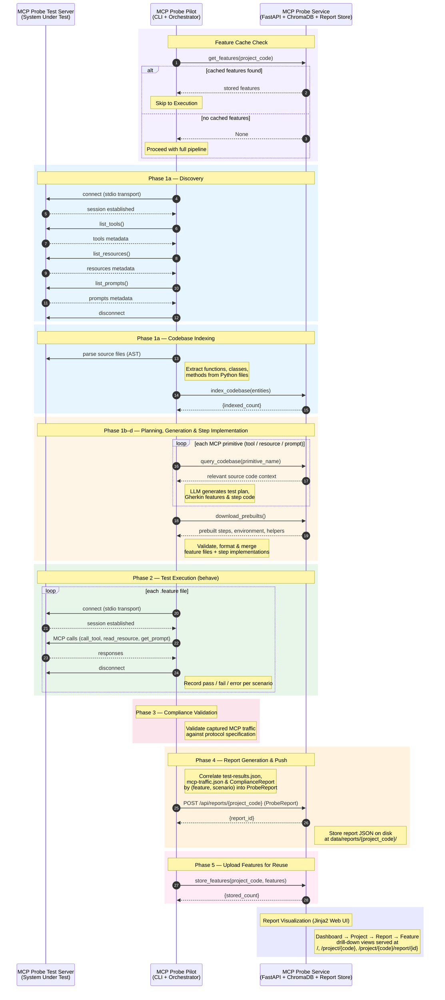

# Simple Sequence Diagram — Three-Component View

```mermaid
sequenceDiagram
    autonumber
    participant TestServer as MCP Probe Test Server<br/>(System Under Test)
    participant Pilot as MCP Probe Pilot<br/>(CLI + Orchestrator)
    participant Service as MCP Probe Service<br/>(FastAPI + ChromaDB + Report Store)

    %% ━━━━━━━━━━━━━━━━━━━━━━━━━━━━━━━━━━
    %% Feature Cache Check
    %% ━━━━━━━━━━━━━━━━━━━━━━━━━━━━━━━━━━

    rect rgb(245, 240, 255)
        Note over Pilot, Service: Feature Cache Check
        Pilot ->> Service: get_features(project_code)
        alt cached features found
            Service -->> Pilot: stored features
            Note over Pilot: Skip to Execution
        else no cached features
            Service -->> Pilot: None
            Note over Pilot: Proceed with full pipeline
        end
    end

    %% ━━━━━━━━━━━━━━━━━━━━━━━━━━━━━━━━━━
    %% Phase 1a — MCP Discovery
    %% ━━━━━━━━━━━━━━━━━━━━━━━━━━━━━━━━━━

    rect rgb(230, 245, 255)
        Note over TestServer, Service: Phase 1a — Discovery
        Pilot ->> TestServer: connect (stdio transport)
        TestServer -->> Pilot: session established
        Pilot ->> TestServer: list_tools()
        TestServer -->> Pilot: tools metadata
        Pilot ->> TestServer: list_resources()
        TestServer -->> Pilot: resources metadata
        Pilot ->> TestServer: list_prompts()
        TestServer -->> Pilot: prompts metadata
        Pilot ->> TestServer: disconnect
    end

    %% ━━━━━━━━━━━━━━━━━━━━━━━━━━━━━━━━━━
    %% Phase 1a — AST Indexing + Upload
    %% ━━━━━━━━━━━━━━━━━━━━━━━━━━━━━━━━━━

    rect rgb(230, 245, 255)
        Note over TestServer, Service: Phase 1a — Codebase Indexing
        Pilot ->> TestServer: parse source files (AST)
        Note right of Pilot: Extract functions, classes,<br/>methods from Python files
        Pilot ->> Service: index_codebase(entities)
        Service -->> Pilot: {indexed_count}
    end

    %% ━━━━━━━━━━━━━━━━━━━━━━━━━━━━━━━━━━
    %% Phase 1b–d — Test Planning & Generation
    %% ━━━━━━━━━━━━━━━━━━━━━━━━━━━━━━━━━━

    rect rgb(255, 245, 230)
        Note over TestServer, Service: Phase 1b–d — Planning, Generation & Step Implementation
        loop each MCP primitive (tool / resource / prompt)
            Pilot ->> Service: query_codebase(primitive_name)
            Service -->> Pilot: relevant source code context
            Note right of Pilot: LLM generates test plan,<br/>Gherkin features & step code
        end
        Pilot ->> Service: download_prebuilts()
        Service -->> Pilot: prebuilt steps, environment, helpers
        Note right of Pilot: Validate, format & merge<br/>feature files + step implementations
    end

    %% ━━━━━━━━━━━━━━━━━━━━━━━━━━━━━━━━━━
    %% Phase 2 — Test Execution
    %% ━━━━━━━━━━━━━━━━━━━━━━━━━━━━━━━━━━

    rect rgb(232, 245, 233)
        Note over TestServer, Service: Phase 2 — Test Execution (behave)
        loop each .feature file
            Pilot ->> TestServer: connect (stdio transport)
            TestServer -->> Pilot: session established
            Pilot ->> TestServer: MCP calls (call_tool, read_resource, get_prompt)
            TestServer -->> Pilot: responses
            Pilot ->> TestServer: disconnect
            Note right of Pilot: Record pass / fail / error per scenario
        end
    end

    %% ━━━━━━━━━━━━━━━━━━━━━━━━━━━━━━━━━━
    %% Phase 3 — Compliance
    %% ━━━━━━━━━━━━━━━━━━━━━━━━━━━━━━━━━━

    rect rgb(252, 228, 236)
        Note over Pilot: Phase 3 — Compliance Validation
        Note right of Pilot: Validate captured MCP traffic<br/>against protocol specification
    end

    %% ━━━━━━━━━━━━━━━━━━━━━━━━━━━━━━━━━━
    %% Phase 4 — Report Generation & Push
    %% ━━━━━━━━━━━━━━━━━━━━━━━━━━━━━━━━━━

    rect rgb(255, 243, 224)
        Note over Pilot, Service: Phase 4 — Report Generation & Push
        Note right of Pilot: Correlate test-results.json,<br/>mcp-traffic.json & ComplianceReport<br/>by (feature, scenario) into ProbeReport
        Pilot ->> Service: POST /api/reports/{project_code} (ProbeReport)
        Service -->> Pilot: {report_id}
        Note right of Service: Store report JSON on disk<br/>at data/reports/{project_code}/
    end

    %% ━━━━━━━━━━━━━━━━━━━━━━━━━━━━━━━━━━
    %% Phase 5 — Upload Features for Reuse
    %% ━━━━━━━━━━━━━━━━━━━━━━━━━━━━━━━━━━

    rect rgb(255, 235, 245)
        Note over Pilot, Service: Phase 5 — Upload Features for Reuse
        Pilot ->> Service: store_features(project_code, features)
        Service -->> Pilot: {stored_count}
    end

    %% ━━━━━━━━━━━━━━━━━━━━━━━━━━━━━━━━━━
    %% Report Visualization (Service Web UI)
    %% ━━━━━━━━━━━━━━━━━━━━━━━━━━━━━━━━━━

    rect rgb(232, 232, 255)
        Note over Service: Report Visualization (Jinja2 Web UI)
        Note right of Service: Dashboard → Project → Report → Feature<br/>drill-down views served at<br/>/, /project/{code}, /project/{code}/report/{id}
    end
```
