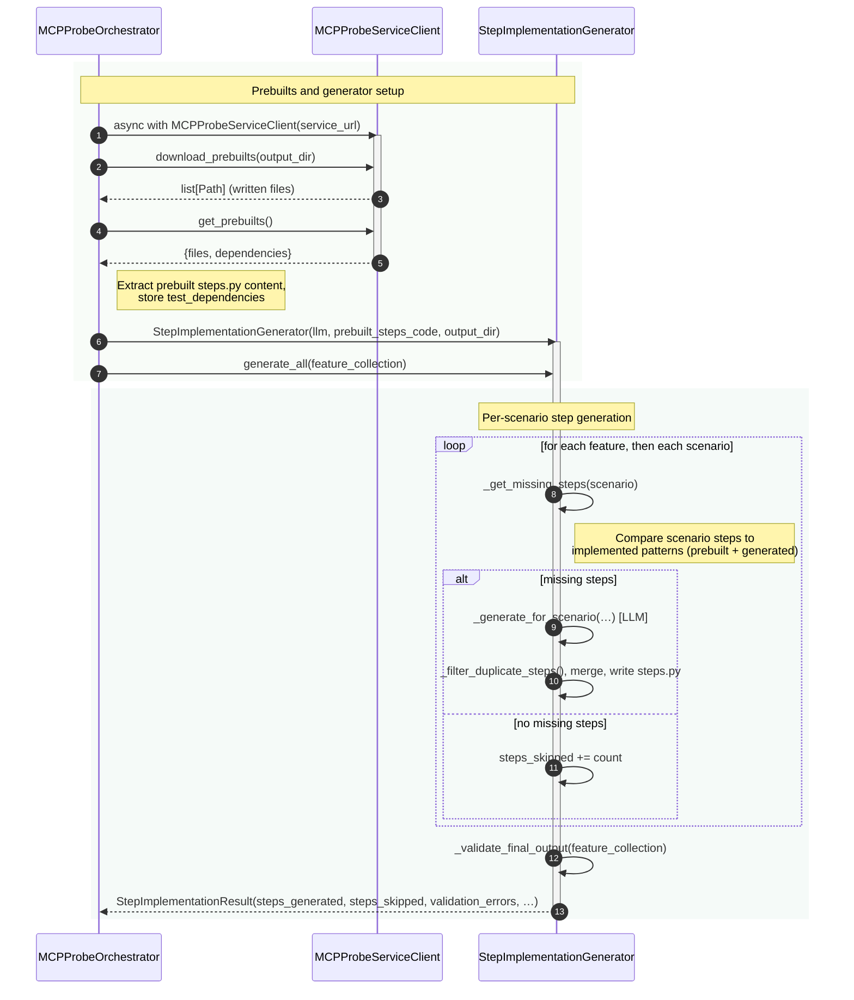

# Sequence Diagram — Step Implementation Generation

Minimum actors: **MCPProbeOrchestrator**, **MCPProbeServiceClient**, **StepImplementationGenerator**.

## Summary

| Step | Orchestrator action | Main interaction |
|------|---------------------|-------------------|
| **Fetch prebuilts** | Uses `MCPProbeServiceClient`: `download_prebuilts(output_dir)` then `get_prebuilts()`. | Service returns prebuilt files (e.g. steps.py) and dependencies; orchestrator stores them and passes steps code to the generator. |
| **Generate implementations** | Creates `StepImplementationGenerator(llm, prebuilt_steps_code, output_dir)`; calls `generate_all(feature_collection)`. | Generator parses prebuilt steps for existing patterns; for each scenario finds missing steps, calls LLM to generate code, deduplicates, appends to steps.py, then runs final validation. Returns `StepImplementationResult`. |
