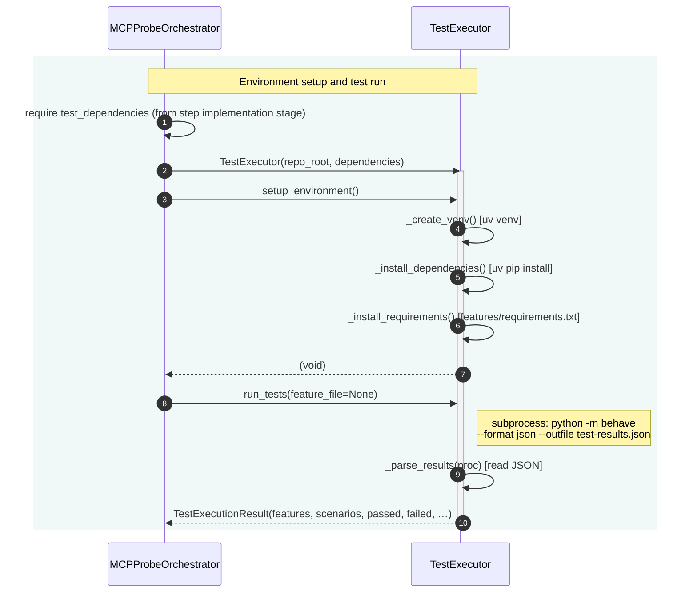

# Sequence Diagram — Test Execution

Minimum actors: **MCPProbeOrchestrator**, **TestExecutor**.

## Summary

| Step | Orchestrator action | Main interaction |
|------|---------------------|------------------|
| **Setup** | Builds `TestExecutor(repo_root, dependencies)` and calls `setup_environment()`. | Executor creates/uses `.mcp-probe-venv`, installs dependencies and `features/requirements.txt`. |
| **Run** | Calls `executor.run_tests(feature_file)`. | Executor runs `behave` in the venv with JSON output to `features/test-results.json`, parses the result into `TestExecutionResult`. |
