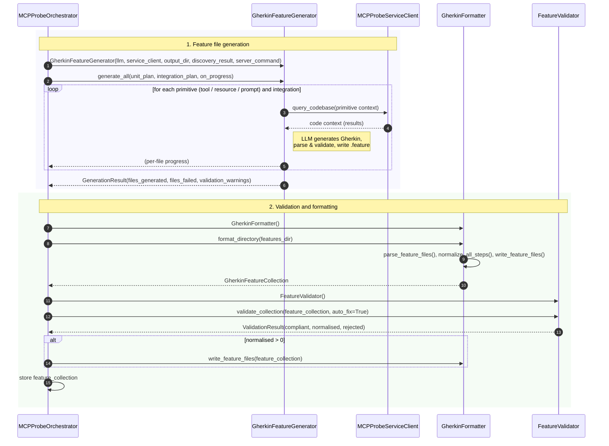

# Sequence Diagram — Test Generation (including Validation and Formatting)

Minimum actors: **MCPProbeOrchestrator**, **GherkinFeatureGenerator**, **MCPProbeServiceClient**, **GherkinFormatter**, **FeatureValidator**.

## Summary

| Phase | Orchestrator action | Main interaction |
|-------|---------------------|-------------------|
| **Generation** | Requires discovery_result, unit_test_plan, integration_test_plan. Creates Generator with LLM and Service; calls `generate_all()`. | Generator iterates over primitives and integration scenarios; calls Service `query_codebase()` for code context; uses LLM to produce Gherkin, then parses, validates, and writes `.feature` files. Returns `GenerationResult`. |
| **Validation & formatting** | Creates GherkinFormatter; calls `format_directory(features_dir)` to parse, normalize step text, and write. Creates FeatureValidator; calls `validate_collection(collection, auto_fix=True)`. If any steps were normalised, calls Formatter `write_feature_files()` again. | Formatter returns `GherkinFeatureCollection`. Validator checks steps against canonical step library, auto-fixes where possible, returns counts (compliant / normalised / rejected). |
