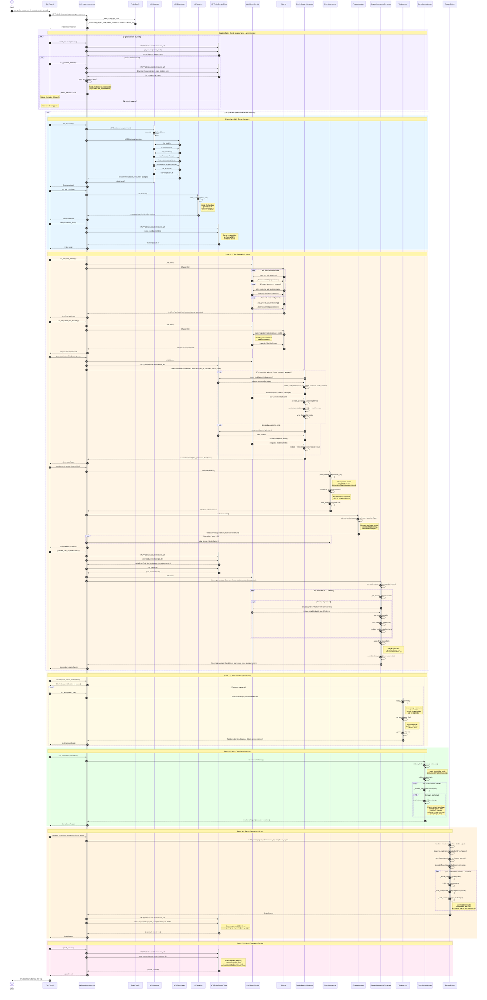

# mcp-probe-pilot Sequence Diagram

```mermaid
sequenceDiagram
    autonumber
    actor User
    participant CLI as CLI (Typer)
    participant Orch as MCPProbeOrchestrator
    participant Config as ProbeConfig
    participant Session as MCPSession
    participant Disc as MCPDiscoverer
    participant AST as ASTIndexer
    participant Service as MCPProbeServiceClient
    participant LLM as LLMClient / Gemini
    participant Plan as Planner
    participant FGen as GherkinFeatureGenerator
    participant Fmt as GherkinFormatter
    participant Val as FeatureValidator
    participant SGen as StepImplementationGenerator
    participant Exec as TestExecutor
    participant Comp as ComplianceValidator
    participant RptBld as ReportBuilder

    %% ━━━━━━━━━━━━━━━━━━━━━━━━━━━━━━━━━━
    %% Initialization
    %% ━━━━━━━━━━━━━━━━━━━━━━━━━━━━━━━━━━

    User ->> CLI: mcp-probe <repo_root> [--generate-new] [--debug]
    CLI ->> Orch: MCPProbeOrchestrator(repo_root, generate_new)
    activate Orch
    Orch ->> Config: _load_config(repo_root)
    Config -->> Orch: ProbeConfig(project_code, server_command, transport, service_url)
    Orch -->> CLI: orchestrator instance

    %% ━━━━━━━━━━━━━━━━━━━━━━━━━━━━━━━━━━
    %% Feature Cache Check
    %% ━━━━━━━━━━━━━━━━━━━━━━━━━━━━━━━━━━

    rect rgb(245, 240, 255)
        Note over CLI, Comp: Feature Cache Check (skipped when --generate-new)

        alt --generate-new NOT set
            CLI ->> Orch: check_previous_features()
            activate Service
            Orch ->> Service: MCPProbeServiceClient(service_url)
            Orch ->> Service: get_features(project_code)
            Service -->> Orch: stored features data or None
            deactivate Service

            alt Stored features found
                CLI ->> Orch: pull_previous_features()
                activate Service
                Orch ->> Service: MCPProbeServiceClient(service_url)
                Orch ->> Service: download_features(project_code, features_dir)
                Service -->> Orch: list of written file paths
                deactivate Service
                Orch ->> Orch: _sync_requirements_deps()
                Note right of Orch: Reads features/requirements.txt<br/>to populate test_dependencies
                Orch -->> CLI: pulled_previous = True
                Note over CLI: Skip to Execution (Phase 2)
            else No stored features
                Note over CLI: Proceed with full pipeline
            end
        end
    end

    %% ━━━━━━━━━━━━━━━━━━━━━━━━━━━━━━━━━━
    %% Phase 1: Discovery + Generation (conditional)
    %% ━━━━━━━━━━━━━━━━━━━━━━━━━━━━━━━━━━

    alt Full generation pipeline (no cached features)

        rect rgb(230, 245, 255)
            Note over CLI, Comp: Phase 1a — MCP Server Discovery

            %% Step 1.1: MCP Server capability discovery
            CLI ->> Orch: run_discovery()
            activate Session
            Orch ->> Session: MCPSession(server_command)
            Session ->> Session: connect() — stdio handshake
            Orch ->> Disc: MCPDiscoverer(session)
            activate Disc
            Disc ->> Session: list_tools()
            Session -->> Disc: ListToolsResult
            Disc ->> Session: list_resources()
            Session -->> Disc: ListResourcesResult
            Disc ->> Session: list_resource_templates()
            Session -->> Disc: ListResourceTemplatesResult
            Disc ->> Session: list_prompts()
            Session -->> Disc: ListPromptsResult
            Disc -->> Orch: DiscoveryResult(tools, resources, prompts)
            deactivate Disc
            Orch ->> Session: disconnect()
            deactivate Session
            Orch -->> CLI: DiscoveryResult

            %% Step 1.2: AST codebase indexing
            CLI ->> Orch: run_ast_indexing()
            Orch ->> AST: ASTIndexer()
            activate AST
            AST ->> AST: index_directory(repo_root)
            Note right of AST: Walks Python files,<br/>parses ASTs,<br/>extracts functions,<br/>classes, methods
            AST -->> Orch: CodebaseIndex(entities, file_hashes)
            deactivate AST
            Orch -->> CLI: CodebaseIndex

            %% Step 1.3: Send codebase index to service
            CLI ->> Orch: send_codebase_index()
            activate Service
            Orch ->> Service: MCPProbeServiceClient(service_url)
            Orch ->> Service: index_codebase(entities)
            Note right of Service: Stores code entities<br/>in ChromaDB for<br/>semantic search
            Service -->> Orch: {indexed_count: N}
            deactivate Service
            Orch -->> CLI: index result
        end

        rect rgb(255, 245, 230)
            Note over CLI, Comp: Phase 1b — Test Generation Pipeline

            %% Step 2.1: Unit test planning
            CLI ->> Orch: run_unit_test_planning()
            activate LLM
            Orch ->> LLM: LLMClient()
            Orch ->> Plan: Planner(llm)
            activate Plan

            loop For each discovered tool
                Plan ->> LLM: plan_tool_unit_tests(tool)
                LLM -->> Plan: _ScenarioListOutput(scenarios)
            end

            loop For each discovered resource
                Plan ->> LLM: plan_resource_unit_tests(resource)
                LLM -->> Plan: _ScenarioListOutput(scenarios)
            end

            loop For each discovered prompt
                Plan ->> LLM: plan_prompt_unit_tests(prompt)
                LLM -->> Plan: _ScenarioListOutput(scenarios)
            end

            Plan -->> Orch: UnitTestPlanResult(tool/resource/prompt scenarios)
            deactivate Plan
            deactivate LLM
            Orch -->> CLI: UnitTestPlanResult

            %% Step 2.2: Integration test planning
            CLI ->> Orch: run_integration_test_planning()
            activate LLM
            Orch ->> LLM: LLMClient()
            Orch ->> Plan: Planner(llm)
            activate Plan
            Plan ->> LLM: plan_integration_tests(discovery_result)
            Note right of LLM: Identifies cross-primitive<br/>workflow patterns
            LLM -->> Plan: IntegrationTestPlanResult
            Plan -->> Orch: IntegrationTestPlanResult
            deactivate Plan
            deactivate LLM
            Orch -->> CLI: IntegrationTestPlanResult

            %% Step 2.3: Feature file generation
            CLI ->> Orch: generate_feature_files(on_progress)
            activate LLM
            activate Service
            Orch ->> LLM: LLMClient()
            Orch ->> Service: MCPProbeServiceClient(service_url)
            Orch ->> FGen: GherkinFeatureGenerator(llm, service, output_dir, discovery, server_cmd)
            activate FGen

            loop For each MCP primitive (tools, resources, prompts)
                FGen ->> Service: query_codebase(primitive_name)
                Service -->> FGen: relevant source code context
                FGen ->> FGen: _render_unit_prompt(prim_type, name, scenarios, code_context)
                FGen ->> LLM: ainvoke(system + human messages)
                LLM -->> FGen: raw Gherkin in markdown
                FGen ->> FGen: _extract_gherkin() + _validate_gherkin()
                FGen ->> FGen: _extract_steps_from_gherkin() — track for reuse
                FGen ->> FGen: write .feature file to disk
            end

            opt Integration scenarios exist
                FGen ->> Service: query_codebase(all primitives)
                Service -->> FGen: code context
                FGen ->> LLM: ainvoke(integration prompt)
                LLM -->> FGen: integration feature Gherkin
                FGen ->> FGen: validate + write integration_workflows.feature
            end

            FGen -->> Orch: GenerationResult(files_generated, files_failed)
            deactivate FGen
            deactivate Service
            deactivate LLM
            Orch -->> CLI: GenerationResult

            %% Step 2.4: Validate and format feature files
            CLI ->> Orch: validate_and_format_feature_files()
            Orch ->> Fmt: GherkinFormatter()
            activate Fmt
            Fmt ->> Fmt: parse_feature_files(features_dir)
            Note right of Fmt: Uses gherkin-official<br/>parser to build AST,<br/>converts to GherkinFeature models
            Fmt ->> Fmt: normalize_all_steps(collection)
            Note right of Fmt: Applies text normalization<br/>rules for step consistency
            Fmt ->> Fmt: write_feature_files(collection)
            Fmt -->> Orch: GherkinFeatureCollection
            deactivate Fmt

            Orch ->> Val: FeatureValidator()
            activate Val
            Val ->> Val: validate_collection(feature_collection, auto_fix=True)
            Note right of Val: Matches each step against<br/>CanonicalStepRegistry,<br/>normalises or rejects
            Val -->> Orch: ValidationResult(compliant, normalised, rejected)
            deactivate Val

            opt Normalised steps > 0
                Orch ->> Fmt: write_feature_files(collection)
            end

            Orch -->> CLI: GherkinFeatureCollection

            %% Step 2.5: Step implementation generation
            CLI ->> Orch: generate_step_implementations()
            activate Service
            Orch ->> Service: MCPProbeServiceClient(service_url)
            Orch ->> Service: download_prebuilts(output_dir)
            Service -->> Orch: prebuilt scaffold files (environment.py, steps.py, etc.)
            Orch ->> Service: get_prebuilts()
            Service -->> Orch: {files, dependencies}
            deactivate Service

            activate LLM
            Orch ->> LLM: LLMClient()
            Orch ->> SGen: StepImplementationGenerator(llm, prebuilt_steps_code, output_dir)
            activate SGen
            SGen ->> SGen: extract_implemented_steps(prebuilt_code)

            loop For each feature → scenario
                SGen ->> SGen: _get_missing_steps(scenario)
                opt Missing steps found
                    SGen ->> LLM: ainvoke(system + human with scenario text)
                    LLM -->> SGen: Python code block with step definitions
                    SGen ->> SGen: ast.parse() validation
                    SGen ->> SGen: _filter_duplicate_steps(code)
                    SGen ->> SGen: update _implemented_patterns
                end
            end

            SGen ->> SGen: _write_final_steps_file()
            Note right of SGen: Merges prebuilt +<br/>generated code into<br/>features/steps/steps.py
            SGen ->> SGen: _validate_final_output(feature_collection)
            SGen -->> Orch: StepImplementationResult(steps_generated, steps_skipped, errors)
            deactivate SGen
            deactivate LLM
            Orch -->> CLI: StepImplementationResult
        end

    end

    %% ━━━━━━━━━━━━━━━━━━━━━━━━━━━━━━━━━━
    %% Phase 2: Execution (always runs)
    %% ━━━━━━━━━━━━━━━━━━━━━━━━━━━━━━━━━━

    rect rgb(255, 250, 230)
        Note over CLI, Comp: Phase 2 — Test Execution (always runs)

        CLI ->> Orch: validate_and_format_feature_files()
        Orch -->> CLI: GherkinFeatureCollection (re-parsed)

        loop For each .feature file
            CLI ->> Orch: run_tests(feature_file)
            Orch ->> Exec: TestExecutor(repo_root, dependencies)
            activate Exec
            Exec ->> Exec: setup_environment()
            Note right of Exec: Creates .mcp-probe-venv<br/>via `uv venv`,<br/>installs dependencies<br/>via `uv pip install`
            Exec ->> Exec: run_tests(feature_file)
            Note right of Exec: subprocess.run:<br/>python -m behave<br/>--format json
            Exec ->> Exec: _parse_results(proc)
            Exec -->> Orch: TestExecutionResult(passed, failed, errored, skipped)
            deactivate Exec
            Orch -->> CLI: TestExecutionResult
        end
    end

    %% ━━━━━━━━━━━━━━━━━━━━━━━━━━━━━━━━━━
    %% Phase 3: Compliance Validation
    %% ━━━━━━━━━━━━━━━━━━━━━━━━━━━━━━━━━━

    rect rgb(230, 255, 230)
        Note over CLI, Comp: Phase 3 — MCP Compliance Validation

        CLI ->> Orch: run_compliance_validation()
        Orch ->> Comp: ComplianceValidator()
        activate Comp
        Comp ->> Comp: validate_file(features/mcp-traffic.json)
        Note right of Comp: Loads JSON-RPC traffic<br/>captured during test execution
        Comp ->> Comp: validate_traffic(data)

        loop For each scenario in traffic
            Comp ->> Comp: _validate_scenario(scenario_data)
            loop For each exchange
                Comp ->> Comp: _validate_exchange(idx, exchange)
                Note right of Comp: Checks jsonrpc envelope,<br/>method-specific rules<br/>(initialize, tools/list,<br/>tools/call, resources/read,<br/>prompts/get, etc.)
            end
        end

        Comp -->> Orch: ComplianceReport(scenarios, violations)
        deactivate Comp
        Orch -->> CLI: ComplianceReport
    end

    %% ━━━━━━━━━━━━━━━━━━━━━━━━━━━━━━━━━━
    %% Phase 4: Report Generation & Push
    %% ━━━━━━━━━━━━━━━━━━━━━━━━━━━━━━━━━━

    rect rgb(255, 243, 224)
        Note over CLI, RptBld: Phase 4 — Report Generation & Push

        CLI ->> Orch: generate_and_push_report(compliance_report)
        Orch ->> RptBld: build_report(project_code, features_dir, compliance_report)
        activate RptBld

        RptBld ->> RptBld: load test-results.json (behave JSON output)
        RptBld ->> RptBld: load mcp-traffic.json (recorded MCP exchanges)
        RptBld ->> RptBld: index ComplianceReport by (feature, scenario)
        RptBld ->> RptBld: index traffic exchanges by (feature, scenario)

        loop For each behave feature → scenario
            RptBld ->> RptBld: _derive_scenario_status(steps)
            RptBld ->> RptBld: _build_step_results(steps)
            RptBld ->> RptBld: _build_compliance_detail(compliance_result)
            RptBld ->> RptBld: _build_exchanges(traffic_exchanges)
            Note right of RptBld: Correlate test results,<br/>compliance, and traffic<br/>by (feature_name, scenario_name)
        end

        RptBld -->> Orch: ProbeReport
        deactivate RptBld

        activate Service
        Orch ->> Service: MCPProbeServiceClient(service_url)
        Orch ->> Service: POST /api/reports/{project_code} (ProbeReport JSON)
        Note right of Service: Stores report as JSON file at<br/>data/reports/{project_code}/{report_id}.json
        Service -->> Orch: {report_id, stored: true}
        deactivate Service

        Orch -->> CLI: ProbeReport
    end

    %% ━━━━━━━━━━━━━━━━━━━━━━━━━━━━━━━━━━
    %% Phase 5: Upload Features for Reuse
    %% ━━━━━━━━━━━━━━━━━━━━━━━━━━━━━━━━━━

    rect rgb(255, 235, 245)
        Note over CLI, RptBld: Phase 5 — Upload Features to Service

        CLI ->> Orch: upload_features()
        activate Service
        Orch ->> Service: MCPProbeServiceClient(service_url)
        Orch ->> Service: store_features(project_code, features_dir)
        Note right of Service: Walks features/ directory,<br/>reads all storable files<br/>(.feature, .py, .json, .txt, etc.),<br/>PUTs to /api/features/{project_code}
        Service -->> Orch: {stored_count: N}
        deactivate Service
        Orch -->> CLI: upload result
    end

    deactivate Orch
    CLI -->> User: Pipeline finished! (Total: Xm Ys)
```
